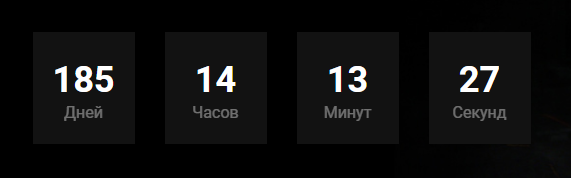

## Timer module for your website (JS module)
---
## How to use this module properly:

- ***Click the timer.js file. On the file page, click the Raw button. This opens the raw code in your browser. Right-click the page and select Save as…, then name the file and place it in your project directory.***
- ***Import the function into your main JS file*** (Its initial name is 'timer', yeah that simple)
- ***Call the function with all the arguments passed to it in the next order:***
    * ***deadline*** (in the ***YYYY/MM/DD*** format)
    * ***timerBlockSelector*** (the main wrapper that contains all the elements related to the timer)
    * ***daysSelector*** (the element in which days are going to be displayed)
    * ***hoursSelector*** (the element in which hours are going to be displayed)
    * ***minutesSelector*** (the element in which minutes are going to be displayed)
    * ***secondsSelector*** (the element in which seconds are going to be displayed)
---
## example: 

```html
          <div class="timer">
            <div class="timer__slot">
              <span id="timerDays" class="timer__left">18</span>
              <span class="timer__measure">Дней</span>
            </div>
            <div class="timer__slot">
              <span id="timerHours" class="timer__left">18</span>
              <span class="timer__measure">Часов</span>
            </div>
            <div class="timer__slot">
              <span id="timerMinutes" class="timer__left">18</span>
              <span class="timer__measure">Минут</span>
            </div>
            <div class="timer__slot">
              <span id="timerSeconds" class="timer__left">18</span>
              <span class="timer__measure">Секунд</span>
            </div>
          </div>
```
```javascript
import timer from './timer';

timer(
'2023-10-10', 
'.timer', 
'#timerDays', 
'#timerHours', 
'#timerMinutes', 
'#timerSeconds');
```

## result:

